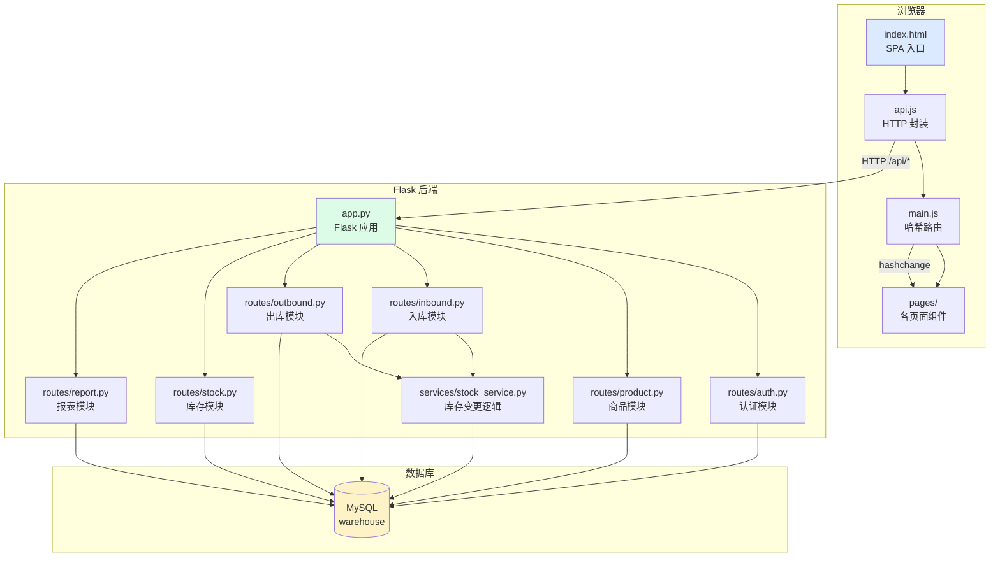
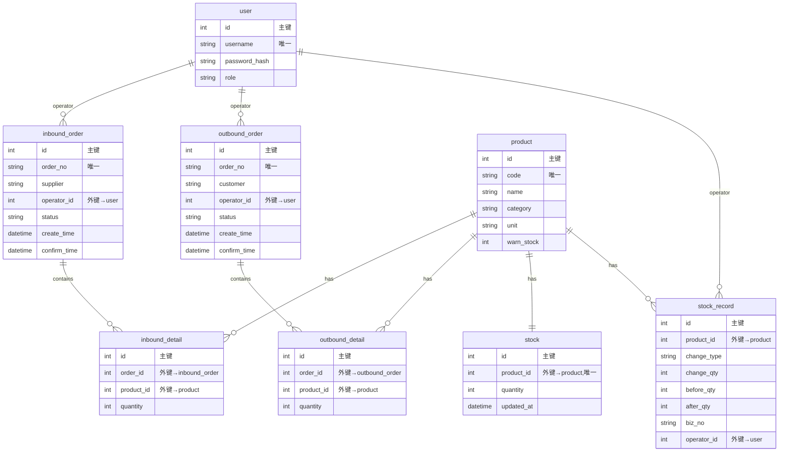
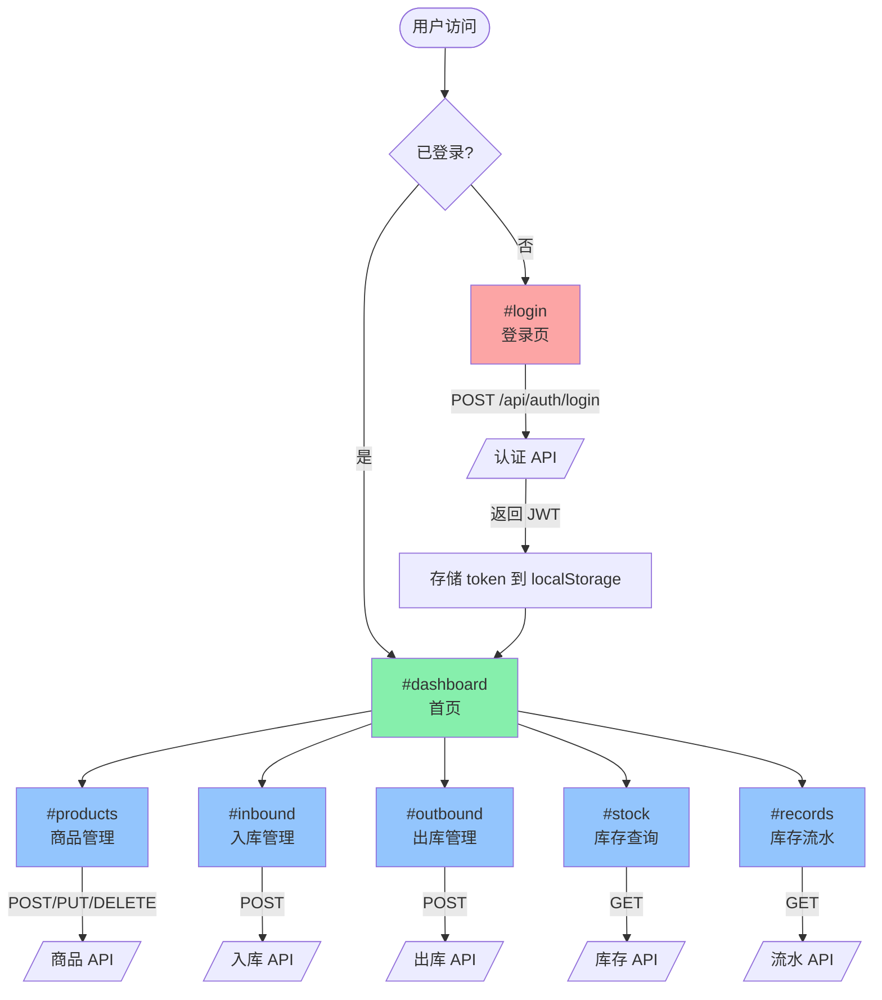
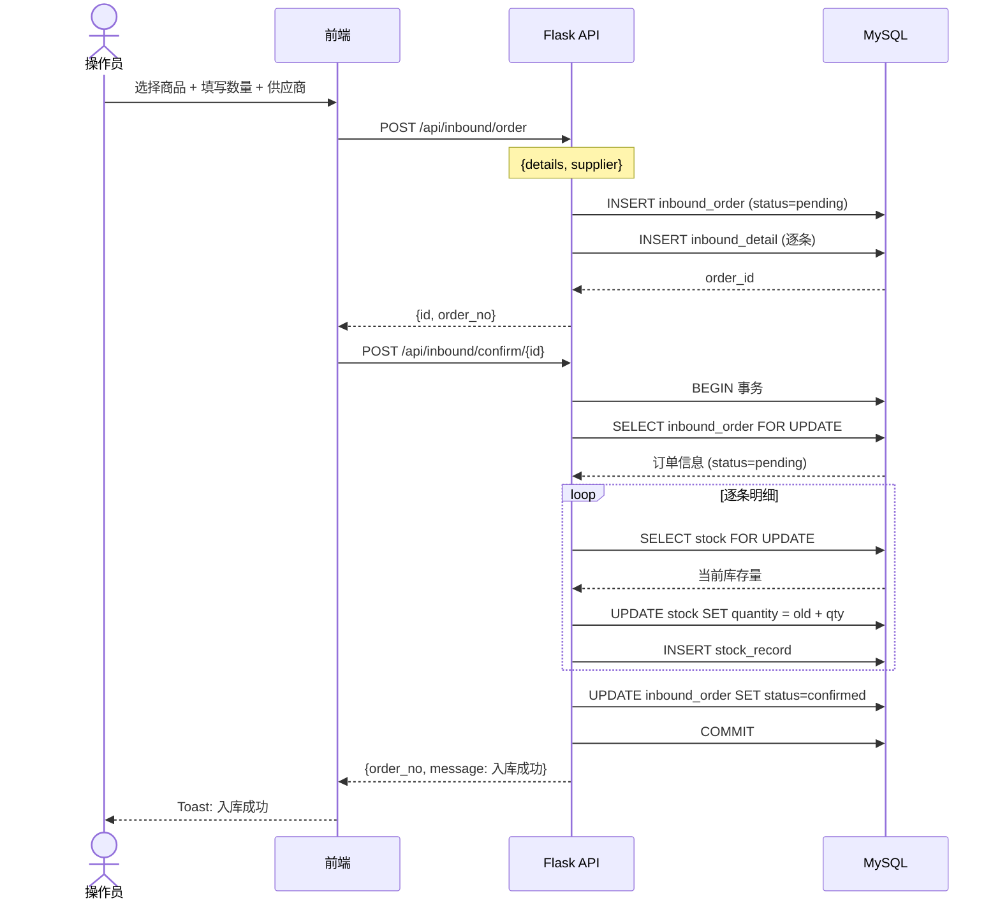
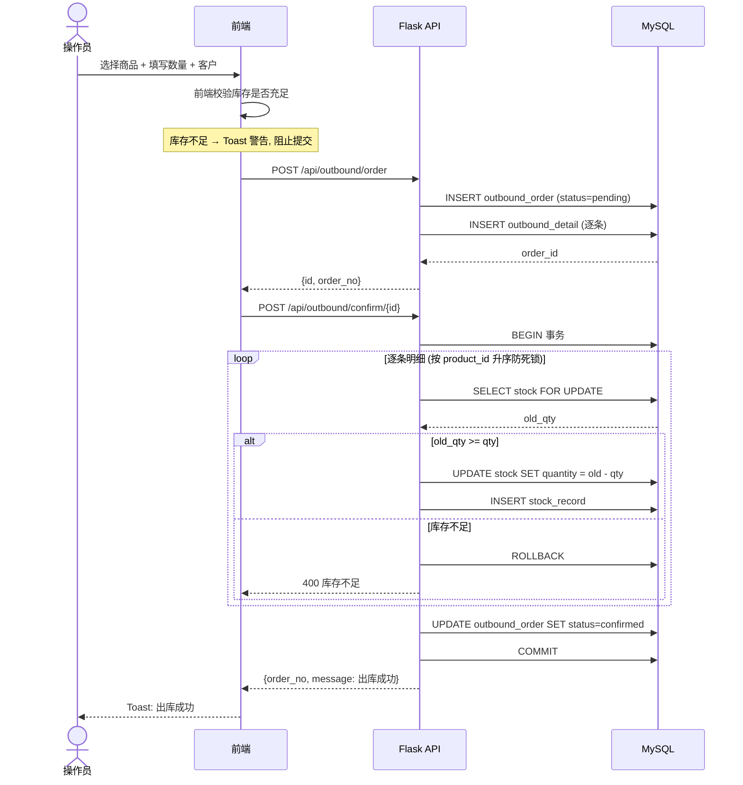
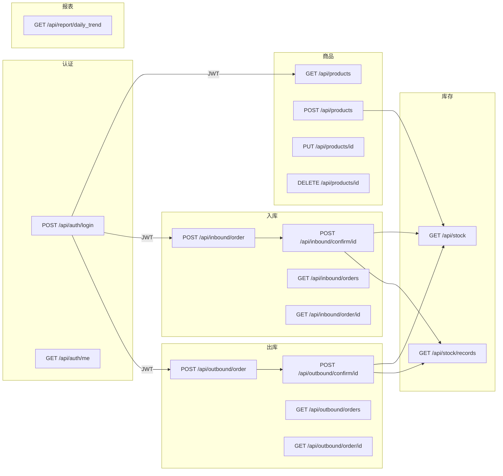
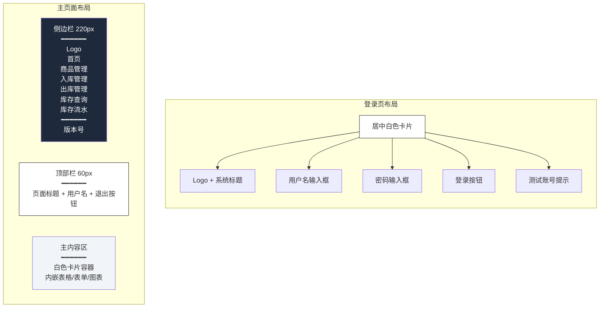
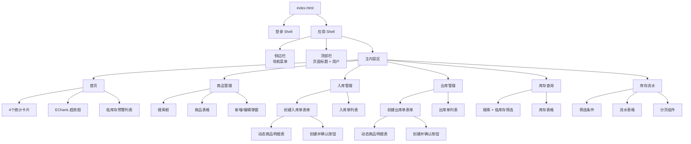

    # 仓库管理系统 — 原型图（Mermaid 图表集）

> 在 VS Code 中安装 Markdown Preview Mermaid Support 插件即可预览

---

## 1. 系统架构图

---

## 2. 数据库 ER 图

---

## 3. 前端页面路由图

---

## 4. 入库业务流程图

---

## 5. 出库业务流程图

---

## 6. API 接口全景图

---

## 7. 前端页面布局图

---

## 8. 组件树

---

## 9. 目录结构图

```mermaid
graph TB
    Root("domo")
    FE("frontend")
    BE("backend")
    Docs("docs")
    Root --> FE
    Root --> BE
    Root --> Docs

    FE_index("index.html")
    FE_css("css")
    FE_js("js")
    FE --> FE_index
    FE --> FE_css
    FE --> FE_js

    css_file("style.css")
    FE_css --> css_file

    api_js("api.js")
    utils_js("utils.js")
    main_js("main.js")
    pages_dir("pages")
    FE_js --> api_js
    FE_js --> utils_js
    FE_js --> main_js
    FE_js --> pages_dir

    login_js("login.js")
    dashboard_js("dashboard.js")
    product_js("product.js")
    inbound_js("inbound.js")
    outbound_js("outbound.js")
    stock_js("stock.js")
    record_js("record.js")
    pages_dir --> login_js
    pages_dir --> dashboard_js
    pages_dir --> product_js
    pages_dir --> inbound_js
    pages_dir --> outbound_js
    pages_dir --> stock_js
    pages_dir --> record_js

    app_py("app.py")
    config_py("config.py")
    env_file(".env")
    init_py("init_db.py")
    req_txt("requirements.txt")
    BE --> app_py
    BE --> config_py
    BE --> env_file
    BE --> init_py
    BE --> req_txt

    models_dir("models")
    routes_dir("routes")
    services_dir("services")
    utils_dir("utils")
    BE --> models_dir
    BE --> routes_dir
    BE --> services_dir
    BE --> utils_dir

    db_py("db.py")
    schemas_sql("schemas.sql")
    models_dir --> db_py
    models_dir --> schemas_sql

    auth_py("auth.py")
    product_r("product.py")
    inbound_r("inbound.py")
    outbound_r("outbound.py")
    stock_r("stock.py")
    report_py("report.py")
    routes_dir --> auth_py
    routes_dir --> product_r
    routes_dir --> inbound_r
    routes_dir --> outbound_r
    routes_dir --> stock_r
    routes_dir --> report_py

    stock_svc("stock_service.py")
    services_dir --> stock_svc

    helpers_py("helpers.py")
    utils_dir --> helpers_py
```

